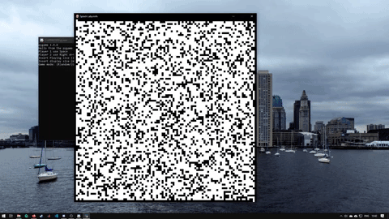

# splash-labyrinth

This is an implementation of the 2 player reactor game called blue dot.

There are 2 players and a grid of walls, some walls dissapear randomly in time, this forms a sort of labyrinth.
When a player first presses the button to check if there's a path to the exit the game checks and if it's true, that player wins, if not, that player loses.

# how the game works

The file you need to run is main.py
The game gets more difficult as the maze size increases, you can choose a size betweeen 20 and 100
You also need to specify the window size, it's a square window.
Then you'll need to pick the game mode (random or grid).

There are 2 players, player1 uses Space and the other one uses right arrow.

If one of the players presses a button the path finding algorithm starts, if there's a path that player wins (green - player1 wins, blue -player2 wins), if not the player loses (the background it's gonna turn red).

The the game can be restarted by pressing r.



# How to run

First run
```pip3 install -r requirement.txt```

then
```./main.py```
